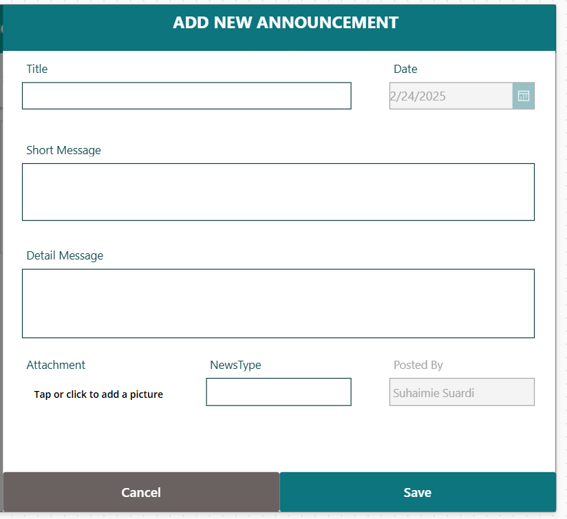
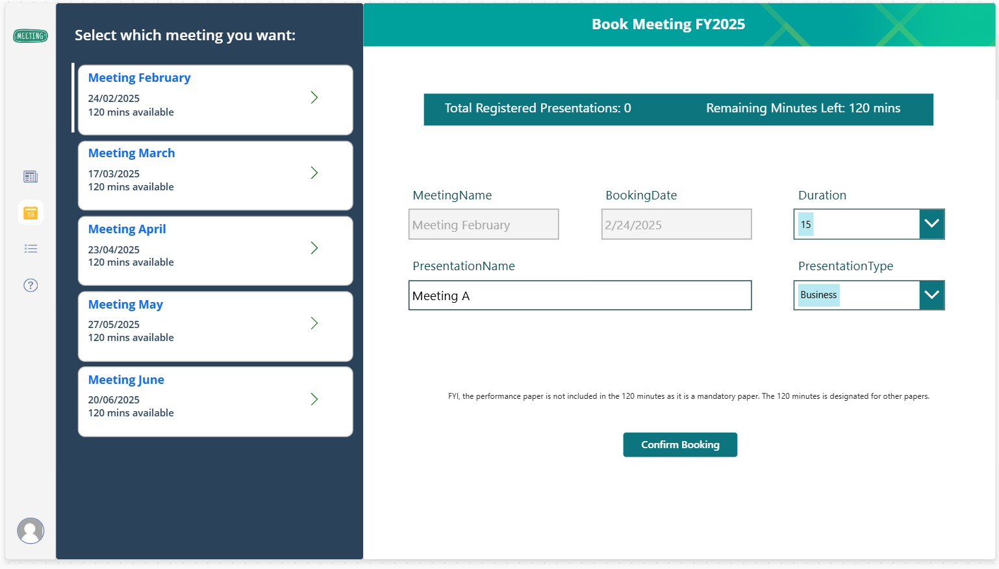
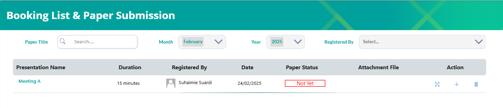
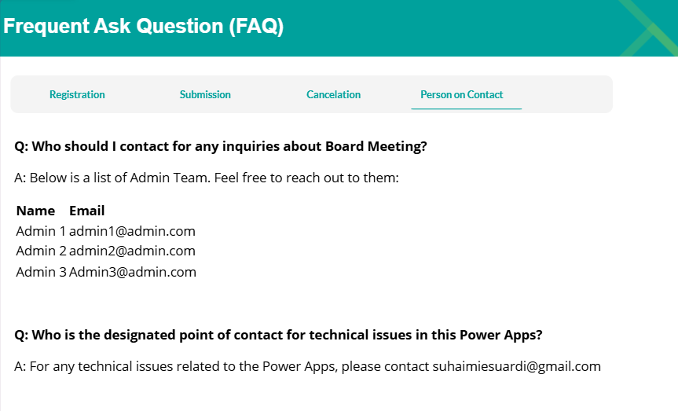

# 📖Introduction
Managing meeting schedules manually can be time-consuming and inefficient for administrators. This Power Apps Booking System aims to reduce the admin’s workload by allowing presenters to self-register their meeting slots, editing and deleting.

With this system, presenters can directly view available slots, register their presentations, and receive automated confirmation emails via Power Automate flows. The admin no longer needs to manually send emails or track individual meeting requests, significantly reducing man-hours spent on coordination.

# 📌Features
- View Available Meetings – Displays available meeting slots based on SharePoint data
- Book a Meeting – Users can select a slot and submit booking details
- Availability Check – Ensures total bookings do not exceed 2 hours per session
- Email Notifications – Sends a confirmation email upon booking
- Admin Panel – View and manage booked meetings & manage announcement

# 🛠Tech Stack
- Power Apps – Frontend for booking interface
- SharePoint Lists – Backend data storage
- Power Automate – Automates email notifications

# 📸 Screenshots
### 🏠 Home Screen (News)
> Displays the latest announcements for all users.
.png)

### 🔧 Admin Panel
> Allows admins to create, edit, and delete news.

### 📅 Meeting List (FY 2025) & Booking Form
> Displays available meetings with a booking form; auto-sends emails to admin and CCs the user.

### 📋 Booking List
> Shows all bookings; users can attach files, edit, or delete their bookings; auto-sends emails to admin and CCs the user.

### ❓ FAQ Section
> Provides information for users to understand the system.

# 📧Contact & Contributions  
- Contributions are welcome! Feel free to submit issues.
- Want the `.msapp` file? **DM me on LinkedIn**

